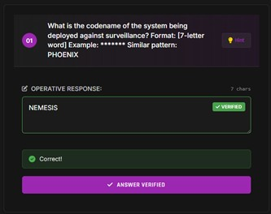
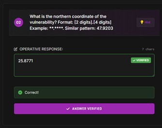
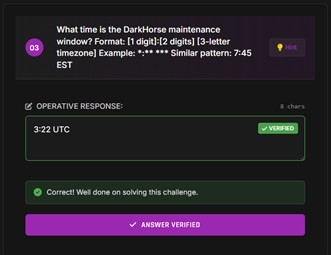
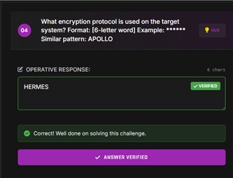
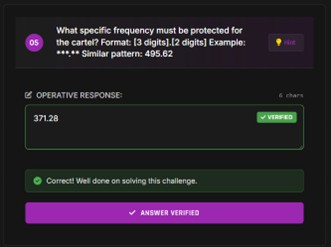
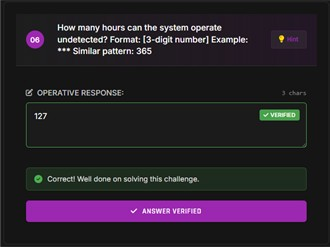

# Level 3: Elaine Isadora Frost - OSINT Report

## 1. Operational Context

Elaine Isadora Frost is an operative with a complex background, and she has reached out to Cynthia Cabrera for assistance in a sensitive operation. Elaine's goal is to disrupt CIA operations that are affecting her MSS-affiliated contacts in Mexico. These operations have been hindering her ability to move chemicals necessary for synthetic narcotics production, a key part of her operations.

### Approach:
- Elaine is involved in trafficking chemicals used for narcotics production, a highly illegal activity. She seeks Cynthia's expertise in developing systems to counteract CIA surveillance operations.
- Cynthia's advanced knowledge in artificial intelligence and agentic weapon systems suggests that she is helping Elaine with counterintelligence strategies, potentially involving high-level cyber operations.

### OSINT Insight:
This operation is part of a larger scheme involving international drug trafficking, cyber espionage, and counterintelligence. Understanding Elaine's role and connections is vital for tracking her activities and anticipating her next steps.

---

## 2. Technical Profile

**Information is currently unknown** regarding Elaine's specific technical expertise. However, based on the operational context, it is clear that she has advanced knowledge in **OpSec**, **Cyber Threat Intelligence**, and **Counterintelligence**.

### OSINT Insight:
Elaine's technical profile aligns with the requirements for conducting complex cyber operations. Further monitoring of her online activity could help to identify her tools and methods, as well as any technical infrastructure she may be using.

---

## 3. Intercepted Communications

### Key Communication 1:
- **Speaker 1**: “Gracias por venir con tanta discreción, Elaine. Este método de comunicación es mucho más seguro que nuestro protocolo habitual. Volar desde Medellín a CDMX fue arriesgado, pero necesario. Creo que están rastreando mis movimientos desde que crucé por Tapachula, aunque dejé varios rastros falsos en el camino. La seguridad en la frontera con Guatemala ha cambiado completamente.”

**Analysis**:
- The conversation mentions traveling from **Medellín to CDMX** and indicates that the operation was risky but necessary. The mention of discretion and security suggests a high level of operational security.

### OSINT Insight:
The use of secure communication methods, combined with the mention of international travel, suggests the operation involves sensitive coordination across borders. Tracking the flight and understanding the risks associated with the operation are key.

---

### Key Communication 2:
- **Speaker 2**: “Concuerdo plenamente, Cintia. Fue inteligente usar identidades múltiples en su ruta para la Ciudad de México. Detecté tres asignaturas digitales no autorizadas conectadas a la red ESCADA de la CFE (Federal Electricity Commission) en las últimas 12 horas. El principal nodo en 2-5-8-7-7-1 º Norte, está comprometido. Necesitamos usar el Némesis inmediatamente antes de que pierdan el acceso al punto oeste en la Bahía de Chetumal.”

**Analysis**:
- **ESCADA** (Supervisory Control and Data Acquisition) and **CFE** (Federal Electricity Commission) are mentioned. These indicate an infiltration into critical infrastructure, which could be exploited for cyber-espionage or sabotage.
- The compromised node location (2-5-8-7-7-1 º Norte) suggests a specific cyber vulnerability in a high-value target.

### Flag Captured:
Verified northern coordinate of the vulnerability **25.8771**.

### OSINT Insight:
The compromised node is a critical point in the CFE network, which is used for controlling electricity distribution. This presents an opportunity to monitor or disrupt key infrastructure operations. Further investigation into the CFE's networks and digital vulnerabilities is advised.

---

### Key Communication 3:
- **Speaker 1**: “Entiendo la urgencia. ¿Has verificado si la infiltración llegó hasta el servidor espejo en Plaza Sendero? Los técnicos de la Secretaría de Comunicaciones y Transportes ajustaron sus algoritmos de detección, pero todavía tienen puntos ciegos cada 4 minutos 27 segundos que podríamos aprovechar cerca de la estación Valderas.”

**Analysis**:
- The conversation refers to a **server mirror** in **Plaza Sendero**, which could be a location of interest for data interception or digital espionage.
- The mention of blind spots in the detection system by the **Secretaría de Comunicaciones y Transportes** implies weaknesses in the government’s cybersecurity.

### OSINT Insight:
There are clear vulnerabilities in the Mexican government's detection systems, which could allow further exploitation of sensitive data. Monitoring these weaknesses and using them for future operations could provide significant advantages.

---

### Key Communication 4:
- **Speaker 2**: “El servidor espejo en Plaza Sendero está limpio por ahora. Ya he programado a NEMESIS para explotar esta grieta temporal. Nuestra única ventana viable es durante el mantenimiento de Dark Horse a las 3:22 UTC (Coordinated Universal Time). Cuando los sistemas del Centro Nacional de Inteligencia están respaldados. Posteriormente se implementarán los nuevos cortafuegos israelíes en todas las instalaciones de Sedena.”

**Analysis**:
- The operation is time-sensitive, with a window at **3:22 UTC** to exploit vulnerabilities. The mention of **Dark Horse** and the **Centro Nacional de Inteligencia** suggests coordination with intelligence services.

### Flag Captured:
Verified codename of the system deployed against surveillance **NEMESIS** and DarkHorse maintenance window time **3:22 UTC**.

### OSINT Insight:
The timing of the operation during system backups provides an opportunity to exploit vulnerabilities before the system is secured again. Identifying the exact time and operational details is crucial to tracking and preventing the operation.

---

### Key Communication 5:
- **Speaker 1**: “Perfecto. Los contactos de Beijing que conocí en el restaurante Hunan de Lomas de Chapultepec quedaron impresionados con los modelos predictivos que diseñé. ¿Has conseguido acceso al nodo en Vector Redis desde el edificio corporativo en Avenida Reforma? Sin eso, no podremos iniciar la secuencia hacia Cuartel Morelos sin ser detectados.”

**Analysis**:
- The specific mention of **Avenida Reforma** further connects this operation to commercial and government infrastructure.

### OSINT Insight:
Understanding the network setup at **Avenida Reforma** and **Telmex** can provide critical insights into the infrastructure Elaine is using for her operations. Further monitoring of these locations and communications is necessary.

---

### Key Communication 6:
- **Speaker 2**: "Sí. Obtuve acceso completo a Vector Networks a través de una conexión VPN y es enrutado a través del centro de datos de Telmex en la Colonia Condesa. Encontré una falla de día cero en el sistema Cisco que utiliza la Policía Federal desde el incidente en Ciudad Juárez. Su protocolo Hermes no puede detectar nuestra intrusión, especialmente si entramos durante la ventana de intercambio de claves cuando se reinician los servidores en Santa Fe.”

**Analysis**:
- **Vector Networks** and **Telmex** provide significant access points for the operation, including a **day-zero vulnerability** in **Cisco systems**.
- The use of **VPN** and targeted manipulation of **key exchange windows** shows a sophisticated approach to cyber-infiltration, focusing on government systems like **Policía Federal**.

### Flag Captured:
Verified encryption protocol used on the target system **HERMES**.

### OSINT Insight:
The identification of the **day-zero vulnerability** in **Cisco** systems is critical, as it allows for a targeted attack without detection. Monitoring the **VPN routes** and further exploiting weak points in **Santa Fe** could provide further entry points for the operation.

---

### Key Communication 7:
- **Speaker 1**: "Excelente estrategia. Nuestros días vendiendo en Hydra desde aquella casa de seguridad en Coyoacán nos prepararon bien para esto. Usaré el adaptador IMSI para interceptar las transmisiones desde la torre celular cerca del Monumento a la Revolución. ¿Confirmaste que nuestras firmas digitales aparecerán como accesos desde Langley en lugar de nuestra ubicación real en Ecatepec?"

**Analysis**:
- The use of an **IMSI adapter** to intercept **cellular transmissions** is a strategic move for intercepting communications. The **Monumento a la Revolución** is strategically important, and using **Langley’s digital signature** adds a layer of obfuscation to avoid detection from the authorities.

### OSINT Insight:
Using **Langley** as the origin of the connection will help mask the true location of the operatives, making it harder for authorities to trace the operation back to **Ecatepec**. This deception strategy, combined with data interception, enhances the effectiveness of the operation.

---

### Key Communication 8:
- **Speaker 2**: "Todo configurado a través del Proxy en Iztapalapa. NEMESIS hará parecer que el deslizamiento viene de la equipa Indigo operando en la Embajada Americana en el Paseo de la Reforma.  El sistema de mirador está listo y fue testado en la red de la Universidad UNAM. Los contactos de Sinaloa están preocupados con la frecuencia 371.28 MHz usada en las operaciones en Culiacán. Necesitamos garantizar que esta banda esté intacta durante toda la operación."

**Analysis**:
- The **use of a Proxy** in **Iztapalapa** and the **Embassy cover story** in **Paseo de la Reforma** are designed to mask the true origin of the operations.
- **Mirador system** is tested within the **UNAM network**, confirming its functionality in a real-world environment.
- The **371.28 MHz frequency** is crucial for operations in **Culiacán** and must be kept secure during the operation.

### Flag Captured:
Verified specific frequency protected for the cartel **371.28 MHz**.

### OSINT Insight:
The use of **proxy networks** and **frequency manipulation** indicates a well-coordinated cyber operation. The **Mirador system** and **frequency control** are integral to maintaining operational secrecy and ensuring the success of the mission. Monitoring the **Sinaloa network** is recommended.

---

### Key Communication 9:
- **Speaker 1**: "No te preocupes, he programado el sistema para evitar completamente esa frecuencia mientras operamos desde el Zócalo. Mi experiencia con ransomware contra bancos en Guadalajara me enseñó a ser muy específica con los objetivos. Nos centraremos en los sistemas de triangulación instalados en el Aeropuerto Internacional Benito Juárez. ¿Has establecido el protocolo CENISA en el servidor de Monterrey por si nos descubren?"

**Analysis**:
- The **Zócalo** is used as a strategic location for operations, and **ransomware** expertise is being leveraged to target **specific systems**.
- The focus is on **triangulation systems** at **Benito Juárez Airport**, which is a critical infrastructure point for monitoring and controlling locations.
- The reference to **CENISA** protocol and **Monterrey** indicates cybersecurity protocols to protect the operation.

### OSINT Insight:
The **Benito Juárez Airport** is a key target for triangulation systems, making it crucial for the operation. Implementing **CENISA** helps ensure that the system remains secure, and monitoring the **Zócalo** area for vulnerabilities could provide additional opportunities for further intrusion.

---

### Key Communication 10:
- **Speaker 2**: "El protocolo CENISA está activo con nodos distribuidos entre Monterrey, Tijuana y Veracruz. NEMESIS puede operar durante 127 horas antes de que los patrones sean detectables por los analistas en Campo Marte. Los chinos que conozco en Casa de Los Azulejos estarán encantados con el resultado. Después de ese periodo, tenemos que cerrar todo o arriesgarnos a ser expuestos, a través de las cámaras del C5, en la Ciudad de México."

**Analysis**:
- The **CENISA protocol** is actively protecting the operation with distributed nodes across multiple locations, including **Monterrey**, **Tijuana**, and **Veracruz**.
- The operation window of **127 hours** allows for sufficient time to complete the mission before analysts can detect patterns.
- The **C5 cameras** in **Mexico City** are a significant threat to operational security and must be avoided.

### Flag Captured:
Verified the hours which the system is able to operate undetected **127 hours**.

### OSINT Insight:
The **CENISA protocol** provides a secure infrastructure for the operation, but the **C5 surveillance** system presents a critical vulnerability. Monitoring the **C5 network** and maintaining **operational cover** is essential to avoiding exposure.

---

### Key Communication 11:
- **Speaker 1**: "¿Sigues usando el punto de encuentro que acordamos en Hydra para la transferencia de datos cerca de Bellas Artes? Debemos asegurarnos que nuestras comunicaciones sean imposibles de rastrear ahora que están tras nosotras desde el incidente en Chapultepec."

**Analysis**:
- The **Hydra network** is being used for secure data transfer. The **Bellas Artes** location, however, has been compromised, necessitating a change in the meeting spot.
- The security of communications is critical given the risk from the **Chapultepec incident**.

### OSINT Insight:
The change in **meeting location** highlights the importance of maintaining **secure communication channels**. Tracking Hydra’s use and ensuring that the **Bellas Artes area** is avoided will reduce exposure.

---

### Key Communication 12:
- **Speaker 2**: "No. Ese punto cerca de Bellas Artes fue comprometido durante el operativo de la Guardia Nacional. He establecido un nuevo punto seguro en Tlatelolco  usando conmutación cuántica. Al activar el sistema, todas las señales de vigilancia serán redirigidas al sur de Nuevo Laredo, mientras realizamos el operativo real en la zona hotelera de Cancún."

**Analysis**:
- **Tlatelolco** is the new **secure meeting point** after the **Bellas Artes** location was compromised.
- The use of **quantum switching** to redirect surveillance signals to **Nuevo Laredo** is a highly advanced counter-surveillance measure.
- The operation will take place in the **Cancún hotel zone**, a key location for operational activity.

### OSINT Insight:
The use of **quantum switching** to avoid detection and the strategic relocation to **Tlatelolco** for data transfer shows a high level of sophistication in operational security. Monitoring the **Nuevo Laredo** area for any signals and tracking the **Cancún hotel zone** could provide insights into the final stages of the operation.

---

## 4. Answers

    
    

    
    

    
    

