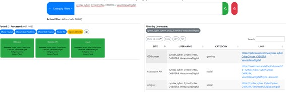
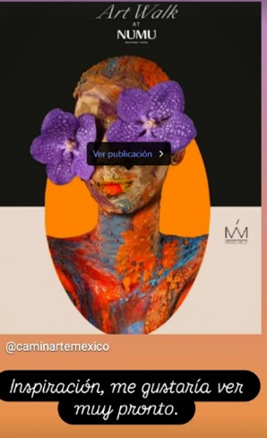

# Level 1: Cynthia Cabrera – OSINT Report

## 1. Alias and Identification

Through username enumeration using tools such as **Namecheckr**, **PimEyes**, and **WhatsMyName**, we identified multiple online aliases linked to the subject, including the handle **cyntax_cyber**.

Subsequent manual investigation on Instagram confirmed that **@cyntax_cyber** is an active profile associated with the subject. The account features digital artwork and uses the initials “C.C.,” which correspond with the subject’s known name, **Cynthia Cabrera**.

The presence of stylized, minimalistic line art further supports the notion that the subject uses this account for artistic expression, potentially as a form of identity obfuscation or as part of her legitimate interests. The language used (“just a part-time artist”) suggests the account is not her main persona, which could imply compartmentalization of identities for operational security (OPSEC).

### Flag Captured:
The correct art-related alias **cyntax_cyber** was verified during a platform intelligence challenge and confirmed via visual evidence.

### OSINT Insight:
This account may serve as a front or distraction from deeper online activity and can be used to trace passive networks of followers or collaborators. Further social graphing of this account is recommended.

---

## 2. Instagram Activity – Current Location

Analysis of the subject’s Instagram profile reveals **two highlighted stories** that confirm her current presence in **Medellín, Colombia**. In these highlights, the subject is seen holding a **coffee and a cigarette**.

Additionally, another highlighted story mentions her intention to attend an **art exhibition in Mexico**, specifically referencing the **“Art Walk at NUMU”** — a well-known event at the Museo Universitario del Chopo (NUMU).

This information strongly suggests that the subject is planning an international trip. Given the destination, the most likely point of departure is **José María Córdova International Airport (IATA: MDE)**, located outside Medellín.

### OSINT Insight:
The subject is preparing for air travel, providing a critical opportunity for surveillance and movement tracking.

---

## 3. Social Networks – Nightlife Preferences

By analyzing **Cynthia’s Instagram followers** and activity patterns, we identified a subset of verified accounts associated with **nightlife venues in Medellín, Colombia**. Among them:

- **@tutiana.medellin** – Refers explicitly to **“TUTIANA POBLADO,”** which is a nightlife venue located in **El Poblado**, a well-known upscale district of Medellín.
- **@lalogia.med** – Linked to **La Logia Medellín**, another recognized nightclub in the same area.

This suggests the subject may have a frequent presence in **El Poblado**, supported by interactions and follows connected to that locality.

Further supporting this hypothesis, challenge-based analysis verified the answer **"El Poblado"** as the district where Cynthia is most likely to engage in social activity. This is consistent with intelligence from the psychological profile indicating she often conducts her online operations from public cafés in the **El Poblado district**, where Wi-Fi access is prevalent.

### Flag Captured:
Verified Cynthia’s favored area for nightlife and connectivity is **El Poblado, Medellín**.

### OSINT Insight:
El Poblado is not only her likely residential or operational base, but also a relevant area for **HUMINT** surveillance or passive monitoring, given the subject’s social and digital footprint concentration in that zone.

---

## 4. Darknet Activity – Identified Forums

As part of our open-source intelligence gathering process, we conducted a search across multiple **darknet** and underground communities to determine where **Cynthia Cabrera** may be active or maintaining a digital presence. Based on her previously identified aliases (**CyberCyntax**, **VenezolanaDigital**, **C4BR3R4**), we focused on known cybercrime forums that match her technical profile and interest in illicit hacking activities.

### Top Relevant Darknet Forums Identified:
- **XSS** (formerly DaMaGeLaB)
- **Nulled.to**
- **BreachForums** *(suspected, under investigation)*
- **Dread** *(confirmed activity)*
- **CryptBB**
- **LeakBase**
- **FreeHacks**
- **Exploit.in**
- **Cracked.to**
- **Altenen**

### Flag Captured:
Confirmed presence on **Dread** forum using alias **CyberCyntax**.

### OSINT Insight:
Cynthia uses darknet forums likely as her main communication method for exchanging illicit tools, intelligence, or for recruitment purposes. Continued monitoring of these forums for activity linked to her aliases is advised.

---

## 5. Answers

