# Level 2: Geolocation Tracking - OSINT Report

## 1. Flight Tracking – Gate Arrival

Identify the gate for flight **AVA234** arriving at **Mexico City Iternational Airport (MEX)** from **Medellín (MDE)** departed at 11:30 on **March 9, 2025**.

### Approach:
- Using **FlightAware**, we filtered the flight data for **AVA234** between **March 8, 2025**, and **March 10, 2025**, confirming the gate for departure on **March 9, 2025** at **MDE** and providing the gate number at **MEX**.
- The possible **arrival gate** at **MEX** is **GATE E1**.

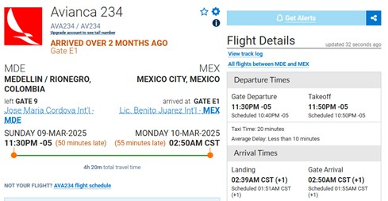

### Flag Captured:
The confirmed **arrival gate** at **MEX** is **GATE E1**, which provides insight into Cynthia’s exact arrival point and potential points of surveillance.

### OSINT Insight:
The gate number helps pinpoint the exact arrival point at Mexico City International Airport, providing an opportunity for targeted surveillance or further monitoring.

---

## 2. Meeting Location – Identifying the Provided Picture

Identify where Cynthia and her friend are meeting based on an image.

### Approach:
- By performing a **reverse image search**, we identified the building as the **Faculty of Architecture** at the **National Autonomous University of Mexico (UNAM)**.
- The architecture, design, and surroundings in the image strongly point to this specific location.

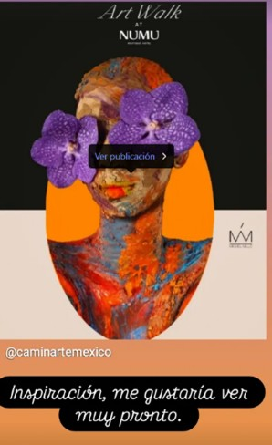

### Flag Captured:
The identified **Faculty of Architecture** at **UNAM** is confirmed as a potential meeting spot for Cynthia.

### OSINT Insight:
This location confirms Cynthia’s presence in a well-known academic institution in Mexico, a potential hotspot for her operational activities or meetings with collaborators.

---

## 3. Restaurant Location – Metro Line Intersection

Identify a restaurant near a pharmacy and near the intersection of L1, L7 and L9 metro lines.

### Approach:
- We used **Google Maps** to search for **pharmacies** in **Mexico City** and checked where the **metro lines 1, 7, and 9** intersect, identifying **Tacubaya station** as a key location.
- **Overpass Turbo** was used to search for restaurants near pharmacies in the area, and the matching result was **La Burrita Marinera**.

    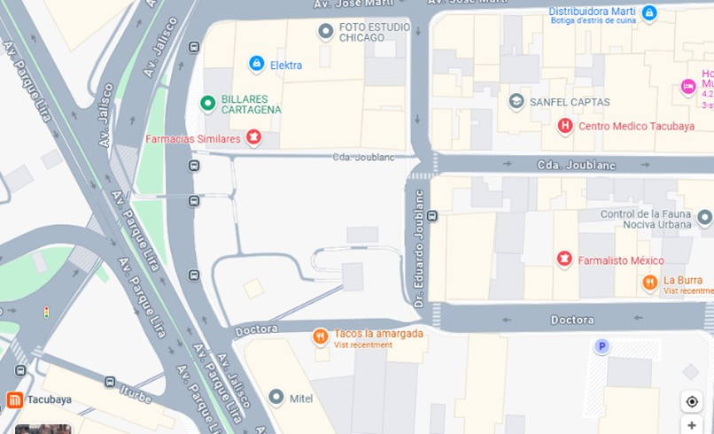
    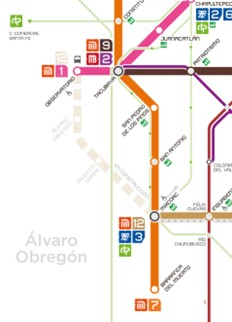

### Flag Captured:
The identified **restaurant** is **La Burrita Marinera**, located near the **Tacubaya metro station**, which aligns with the criteria of proximity to pharmacies and metro intersections.

### OSINT Insight:
The restaurant, **La Burrita Marinera (La Burra)**, located near **Tacubaya**, could be a potential meeting point for Cynthia. The nearby metro lines make it a convenient and well-connected location for her activities.

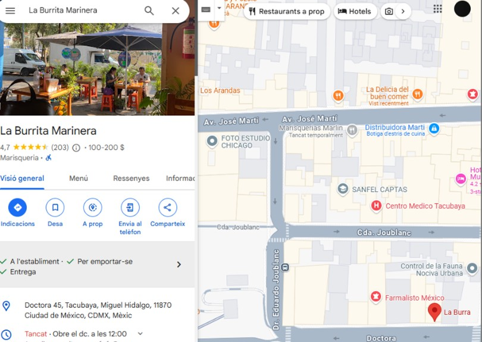

---

## 4. Last Seen Location - Identifying the Provided Picture

Identify the location depicted in an image showing a **mirador** and **museum**.

### Approach:
- Using **Overpass Turbo** and **Google Maps**, we identified the location as the **Bicentennial Museum** located in a **Mirador** at **Bicentenario Park**.
- This park is in a strategic location, offering views of the surrounding area and could be a significant spot for Cynthia’s operations or meetings.

    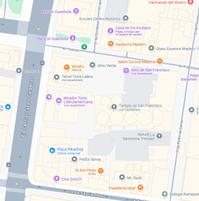
    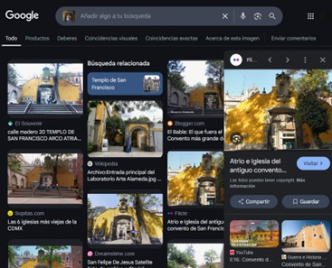

### Flag Captured:
The location has been confirmed as the **Bicentennial Museum** at **Bicentenario Park**, a key landmark for Cynthia’s activities.

### OSINT Insight:
The **Mirador** with the **Bicentennial Museum** is a well-known landmark in Mexico. Cynthia could be using such locations for both personal or operational purposes, blending in with tourists or locals.

---

## 5. Meeting Location 2 - Identifying the Park in Contadero

Identify where Cynthia and her friend are meeting, based on the park info provided.

### Approach:
- The park is called **Parque de la Inmaculada Concepción** - **Contadero**, located in a western district of Mexico City. 
- The name contains the religious concept **Contadero**, as required by the task.

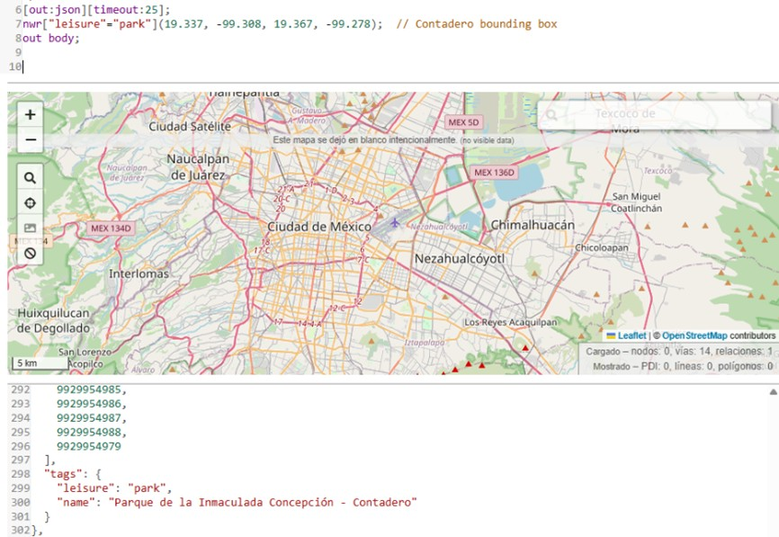

### Flag Captured:
The location has been confirmed as **Parque de la Inmaculada Concepción** in **Contadero**, aligning with the provided clues for her meeting point.

### OSINT Insight:
This park could serve as a quiet spot for Cynthia and her friend to meet and discuss important matters. The area may be suitable for further operational monitoring.

---

## 6. Answers

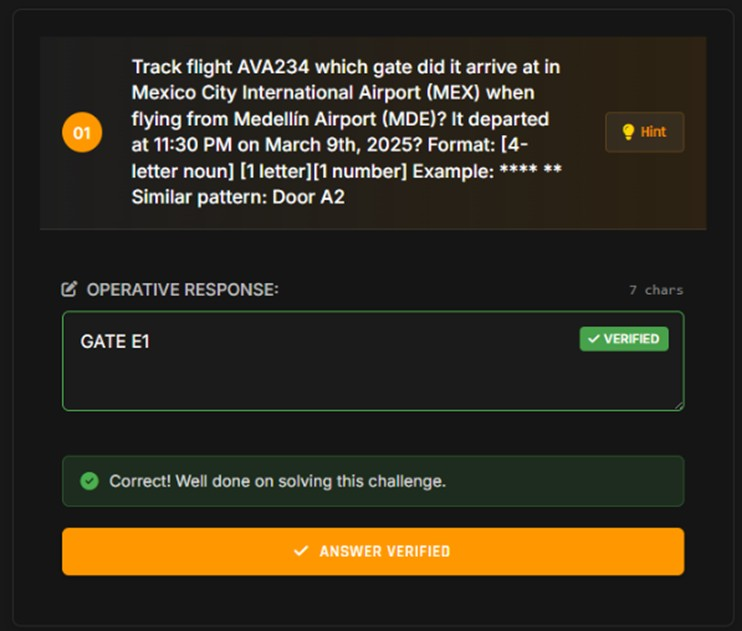

    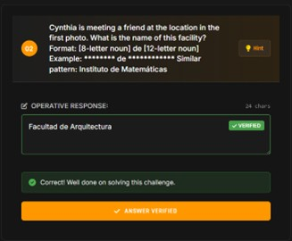
    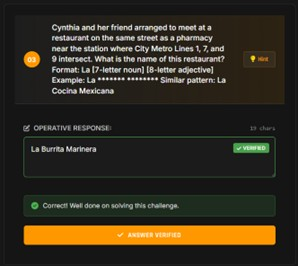

    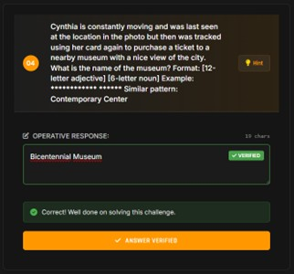
    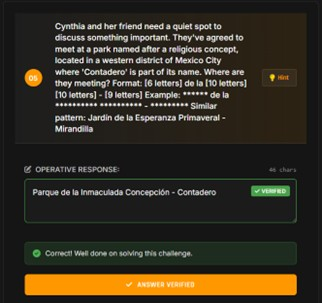

